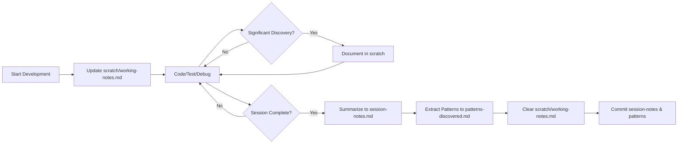

# Working Memory System

## Purpose

This directory provides a **working memory system** for tracking patterns, decisions, and lessons learned during development. While `.github/copilot-instructions.md` contains foundational principles and workflows (persistent memory), this directory captures evolving discoveries and context-specific patterns (working memory).

The memory system enables AI assistants to:
- Learn from previous debugging sessions
- Apply discovered patterns to new problems
- Understand project-specific decisions and trade-offs
- Maintain context across development sessions
- Provide more accurate, context-aware suggestions

## Memory Types

### Persistent Memory
**Location**: `.github/copilot-instructions.md`  
**Purpose**: Foundational principles, standards, and workflows  
**Committed**: Yes  
**Scope**: Project-wide, unchanging guidelines

Contains:
- Core development principles
- Web performance standards
- Accessibility requirements
- Testing strategies
- Code generation guidelines

### Working Memory
**Location**: `.github/memory/`  
**Purpose**: Accumulated discoveries, patterns, and session learnings  
**Committed**: Yes (except `scratch/`)  
**Scope**: Evolving, project-specific knowledge

Contains:
- Historical session summaries
- Discovered code patterns
- Architecture decisions
- Active session work (ephemeral)

## Directory Structure

```
.github/memory/
├── README.md                    # This file - explains the memory system
├── session-notes.md             # Historical summaries of completed sessions (COMMITTED)
├── patterns-discovered.md       # Accumulated code patterns and learnings (COMMITTED)
└── scratch/
    ├── .gitignore              # Ignores all files in scratch/ directory
    └── working-notes.md        # Active session notes (NOT COMMITTED)
```

### File Purposes

#### `session-notes.md` (Historical Record)
**Type**: Historical summaries  
**Committed**: ✅ Yes  
**Updated**: At end of each session

**Purpose**: Document completed development sessions for future reference. Each entry captures what was accomplished, key findings, decisions made, and outcomes.

**Structure**:
```markdown
## [Session Name] - [Date]

### What Was Accomplished
- Bullet points of completed work

### Key Findings and Decisions
- Important discoveries
- Architecture decisions
- Trade-offs and rationale

### Outcomes
- Metrics, test results, or validation
```

**When to Update**:
- ✅ After completing a focused development session
- ✅ When you've resolved a significant bug or implemented a feature
- ✅ After discovering important patterns or making architecture decisions
- ❌ Not during active development (use `scratch/working-notes.md` instead)

#### `patterns-discovered.md` (Pattern Library)
**Type**: Accumulated code patterns  
**Committed**: ✅ Yes  
**Updated**: When patterns emerge or stabilize

**Purpose**: Document recurring code patterns, anti-patterns, and project-specific conventions discovered during development.

**Structure**:
```markdown
## Pattern: [Name]

**Context**: When and where this pattern applies
**Problem**: What problem it solves
**Solution**: How to implement it
**Example**: Code snippet
**Related Files**: Links to examples in codebase
```

**When to Update**:
- ✅ When you notice a pattern repeated 2+ times
- ✅ After fixing a class of bugs with a consistent solution
- ✅ When establishing project-specific conventions
- ✅ After performance or accessibility audits reveal patterns

#### `scratch/working-notes.md` (Active Session)
**Type**: Ephemeral session notes  
**Committed**: ❌ No (gitignored)  
**Updated**: Continuously during active development

**Purpose**: Capture real-time thoughts, discoveries, and progress during active development sessions. Think of this as your development journal.

**Structure**:
```markdown
## Current Task
What you're working on right now

## Approach
How you're tackling the problem

## Key Findings
Discoveries made during this session

## Decisions Made
Choices and their rationale

## Blockers
Current obstacles or unknowns

## Next Steps
What to do next

## Notes
Unstructured observations, ideas, TODOs
```

**When to Update**:
- ✅ Start of each development session
- ✅ After making significant discoveries
- ✅ When encountering blockers or making decisions
- ✅ Before switching contexts or taking breaks
- ✅ End of session (before summarizing to `session-notes.md`)

## Workflow Integration

### TDD (Test-Driven Development) Workflow

**During Red-Green-Refactor Cycle**:

1. **Red Phase** (Write failing test)
   - Note test approach in `scratch/working-notes.md`
   - Document expected behavior

2. **Green Phase** (Make test pass)
   - Capture implementation discoveries
   - Note any surprising behaviors

3. **Refactor Phase** (Improve code)
   - Document patterns that emerge
   - Record refactoring decisions

4. **End of TDD Session**
   - Summarize key findings → `session-notes.md`
   - Extract patterns → `patterns-discovered.md`

**Example Workflow**:
```bash
# Start session
echo "## TDD Session: User Authentication - $(date)" >> .github/memory/scratch/working-notes.md

# During development (continuous updates to scratch/working-notes.md)
# - Write test
# - Implement feature
# - Refactor
# - Note discoveries

# End session
# 1. Review scratch/working-notes.md
# 2. Add summary to session-notes.md
# 3. Extract patterns to patterns-discovered.md
# 4. Clear scratch/working-notes.md for next session
```

### Linting and Code Quality Workflow

**When Fixing Linting Errors**:

1. **Identify Pattern**: Is this error recurring across files?
2. **Document Decision**: Why fix it this way vs alternatives?
3. **Extract Pattern**: Add to `patterns-discovered.md` if applicable

**Example**:
```markdown
## Pattern: ESLint React Hooks Dependencies

**Context**: useEffect/useCallback hooks with external dependencies
**Problem**: Linter warns about missing dependencies, causing stale closures
**Solution**: Include all referenced values in dependency array
**Anti-Pattern**: Disabling eslint rule or using empty array without justification
**Related Files**: src/components/UserDashboard.jsx (lines 45-52)
```

### Debugging Workflow

**During Bug Investigation**:

1. **Document in `scratch/working-notes.md`**:
   - Symptom description
   - Initial hypothesis
   - Tests performed
   - Findings at each step

2. **After Resolution**:
   - Summarize root cause → `session-notes.md`
   - Extract preventative pattern → `patterns-discovered.md`

**Example Flow**:
```markdown
# In scratch/working-notes.md during debugging:

## Blocker: API calls failing with 401 in production only

### Hypothesis 1: Token expiration
- Tested: Logged token TTL → 1 hour (expected)
- Result: Token still valid when error occurs ❌

### Hypothesis 2: CORS configuration
- Tested: Network tab shows preflight succeeds
- Result: Not CORS issue ❌

### Hypothesis 3: Environment variable mismatch
- Tested: Compared .env vs production config
- Result: API_URL missing trailing slash in production ✅

### Solution
- Added trailing slash normalization in API client
- Updated deployment docs

# After resolution, add to session-notes.md:

## Debugging Session: Production 401 Errors - 2026-02-09

### Key Findings
- Production env var API_URL lacked trailing slash
- API client concatenated paths incorrectly: `example.com/apiv1/users`
- Added URL normalization helper

### Outcomes
- Fixed: 100% of production API calls now succeed
- Prevented: Added validation to deployment pipeline

# Add to patterns-discovered.md:

## Pattern: API URL Normalization

**Context**: Configuring external API endpoints via environment variables
**Problem**: Inconsistent trailing slash handling causes 404/401 errors
**Solution**: Normalize URLs in API client constructor
**Example**: 
\```javascript
const normalizeUrl = (url) => url.replace(/\/$/, '');
const apiClient = new ApiClient(normalizeUrl(process.env.API_URL));
\```
```

## How AI Reads and Applies Patterns

### Context Loading
When you start a new chat or development session, AI assistants can:
1. Read `session-notes.md` to understand recent work
2. Review `patterns-discovered.md` for project-specific conventions
3. Reference `scratch/working-notes.md` for current context

### Pattern Application
AI uses these patterns to:
- Suggest solutions consistent with previous decisions
- Avoid anti-patterns you've already encountered
- Provide context-aware code generation
- Reference specific files and line numbers from examples

### Example AI Interaction

**Without Memory**:
```
User: "How should I initialize the service state?"
AI: "You could use null, undefined, or an empty array."
```

**With Memory** (after documenting pattern):
```
User: "How should I initialize the service state?"
AI: "Based on the pattern documented in patterns-discovered.md,
use an empty array [] for service initialization. We discovered
that null/undefined caused issues with .map() operations in
UserDashboard.jsx (lines 45-52). See session-notes.md from
2026-02-05 for the debugging context."
```

## Best Practices

### Do ✅

- **Write as you work**: Update `scratch/working-notes.md` continuously
- **Be specific**: Include file paths, line numbers, error messages
- **Capture 'why'**: Document reasoning behind decisions
- **Quantify outcomes**: Include metrics, test results, performance data
- **Link examples**: Reference actual code in the repository
- **End sessions cleanly**: Summarize to `session-notes.md`, clear scratch notes

### Don't ❌

- **Don't commit scratch notes**: They're ephemeral workspace artifacts
- **Don't document every minor change**: Focus on significant discoveries
- **Don't copy full code blocks**: Reference file locations instead
- **Don't skip rationale**: Future you won't remember why
- **Don't let scratch notes accumulate**: Summarize and clear regularly

## Workflow Summary



## Example Development Session

### 1. Start Session
```bash
# Update scratch/working-notes.md
## Lighthouse Optimization Session - 2026-02-09

### Current Task
Reduce LCP from 3.2s to < 2.5s on homepage

### Approach
1. Run baseline Lighthouse audit
2. Analyze render-blocking resources
3. Implement optimizations incrementally
```

### 2. During Development
```markdown
### Key Findings
- Hero image (1.2MB) is largest contributor
- Loading synchronously blocks paint
- No lazy loading implemented

### Decisions Made
- Convert hero.jpg to WebP (reduces to 320KB)
- Add `loading="lazy"` to below-fold images
- Implement responsive srcset for hero

### Notes
- WebP support: 95% browser coverage (acceptable)
- Considered AVIF but lower support (70%)
```

### 3. End Session
```bash
# Summarize to session-notes.md
## Lighthouse LCP Optimization - 2026-02-09

### What Was Accomplished
- Reduced homepage LCP from 3.2s to 2.1s (34% improvement)
- Converted hero image to WebP format (-73% file size)
- Implemented lazy loading for 8 below-fold images

### Key Findings
- Image format had 3x impact vs lazy loading
- WebP conversions should be standard for all hero images
- Lighthouse CI now catches LCP regressions

### Outcomes
- Lighthouse Performance score: 78 → 92
- LCP: 3.2s → 2.1s ✅ (meets < 2.5s threshold)
- Bundle size unchanged

# Extract to patterns-discovered.md
## Pattern: Hero Image Optimization

**Context**: Large above-the-fold images (> 500KB)
**Problem**: Slow Largest Contentful Paint (LCP > 2.5s)
**Solution**: WebP format + responsive srcset
**Example**: 

**Performance Impact**: -73% file size, -1.1s LCP
**Related Files**: src/components/Hero.jsx

# Clear scratch/working-notes.md for next session
# Commit session-notes.md and patterns-discovered.md
```

## Integration with AI Development

### For AI Assistants

When providing development assistance:

1. **Check working memory first**: Review `session-notes.md` and `patterns-discovered.md`
2. **Apply discovered patterns**: Use project-specific conventions
3. **Reference past sessions**: Link to relevant debugging or optimization sessions
4. **Suggest pattern documentation**: When detecting repeated code patterns
5. **Update scratch notes**: Summarize key points from the current interaction

### For Developers

When starting a new task:

1. **Review recent sessions**: Check `session-notes.md` for context
2. **Search patterns**: Look for relevant patterns in `patterns-discovered.md`
3. **Update scratch notes**: Document your current work
4. **Collaborate with AI**: Reference patterns when asking for assistance

## Maintenance

### Weekly Review
- Review `session-notes.md` for recurring themes
- Consolidate patterns in `patterns-discovered.md`
- Archive old sessions if needed (keep last 12 weeks)

### Monthly Cleanup
- Promote stable patterns to `.github/copilot-instructions.md`
- Archive or remove outdated patterns
- Verify scratch directory is empty (all notes summarized)

---

**Remember**: The memory system is only valuable if you use it. Start small - just update scratch notes during your next session, then build the habit from there.
